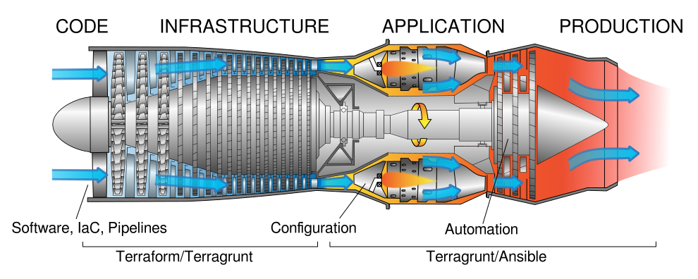

# Turbojet

A repository to generate engines (container images) to provision/orchestrate infrastructure and automate pipelines/configuration management processes.



- One container image, use it everywhere as a [GitHub Actions step](#as-a-github-actions-step), [local installation replacement](#as-a-local-installation-replacement) or [Kubernetes Job](#as-a-kubernetes-job)
- MIT License

The technology stack is **Terraform, Terragrunt, Ansible**. Versions can be found in [Dockerfile](Dockerfile).

> :bulb: **You can customize the version args and build your own image.**

--------------------

**Table of contents**

- [Turbojet](#turbojet)
  - [Concept](#concept)
  - [Environment variables](#environment-variables)
    - [`CHANGE_DIR`](#change_dir)
    - [`GITCONFIG`](#gitconfig)
  - [Usage](#usage)
    - [As a GitHub Actions step](#as-a-github-actions-step)
    - [As a local installation replacement](#as-a-local-installation-replacement)
    - [As a Kubernetes Job](#as-a-kubernetes-job)

## Concept

The main goal of the project is to create a NoOps experience with infrastructure orchestration. If a thing is not infrastructure as code (state declaration) it must be infrastructure as automation (state transition trigger).

## Environment variables

All environment variables available to the container is available to Terraform, Terragrunt, Ansible without any special procedure. Be careful when setting credentials or sensitive data as configuration for your implementation, especially with logging from Terragrunt, Terraform, Ansible.

### `CHANGE_DIR`

A directory to use as current working directory before executing the container command. Default `'/workspace'`.

### `GITCONFIG`

Optional gitconfig file content, useful for private repository authentication when the terragrunt/terraform module source is a git URI. Default:

```
[url "https://git@github.com"]
    insteadOf = "ssh://git@github.com"
[url "https://YOUR_PERSONAL_ACCESS_TOKEN@github.com"]
    insteadOf = "ssh://private@github.com"
```

## Usage

The container image is published at [:package: **the metactron/turbojet GitHub package**](https://github.com/orgs/metacron/packages/container/package/turbojet).

### As a GitHub Actions step

```yaml
# jobs.*.steps:
- name: Run terragrunt apply-all
  uses: docker://ghcr.io/metacron/turbojet:unstable
  id: terragrunt
  timeout-minutes: 30
  env:
    # AWS_ACCESS_KEY_ID: 
    # AWS_SECRET_ACCESS_KEY:

    # GOOGLE_APPLICATION_CREDENTIALS: ${{ github.workspace }}/gcp_credentials.json

    # SOURCE_REF: ${{ github.ref }}

    # CHANGE_DIR: resources/gcp
  with:
    args: terragrunt apply-all --terragrunt-non-interactive
```

### As a local installation replacement

Create a `/usr/local/bin/terraform` file:

```bash
#!/bin/bash
docker run --rm -it -v $(pwd):/workspace ghcr.io/metacron/turbojet:latest terraform $@
```

Create a `/usr/local/bin/terragrunt` file:

```bash
#!/bin/bash
docker run --rm -it -v $(pwd):/workspace ghcr.io/metacron/turbojet:latest terragrunt $@
```

Create a `/usr/local/bin/ansible` file:

```bash
#!/bin/bash
docker run --rm -it -v $(pwd):/workspace ghcr.io/metacron/turbojet:latest ansible $@
```

> :bulb: **Create other files for `ansible-playbook`, `ansible-value` and etc using the same template shown for `ansible` command.**

Mark all files as executables:

```bash
chmod +x \
  /usr/local/bin/terraform \
  /usr/local/bin/terragrunt \
  /usr/local/bin/ansible
```

Now you can use `ansible, terraform and terragrunt` like commands from a local installation.

### As a Kubernetes Job

```yaml
apiVersion: batch/v1
kind: Job
metadata:
  name: ansible-my-playbook
spec:
  backoffLimit: 5
  activeDeadlineSeconds: 100
  template:
    spec:
      containers:
      - name: ansible-playbook
        image: ghcr.io/metacron/turbojet:latest
        command: ["ansible-playbook",  "-i", "localhost,", "-c", "local", "my_playbook.yml"]
      restartPolicy: Never
```